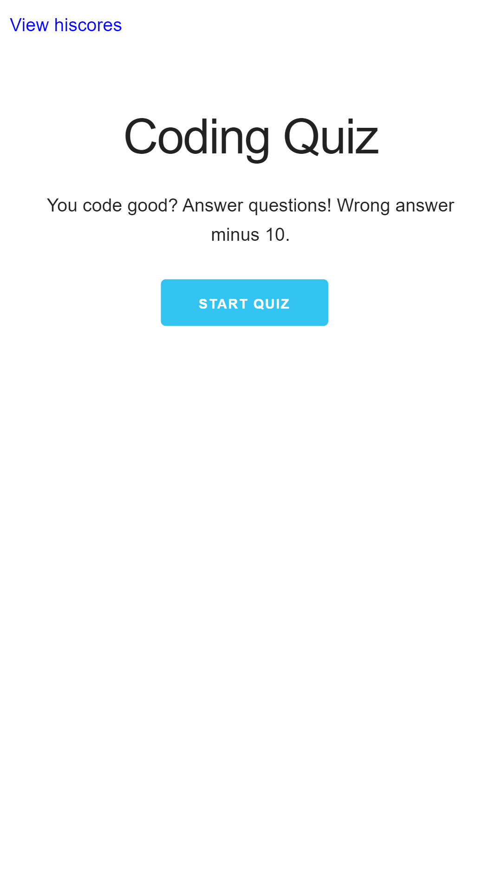
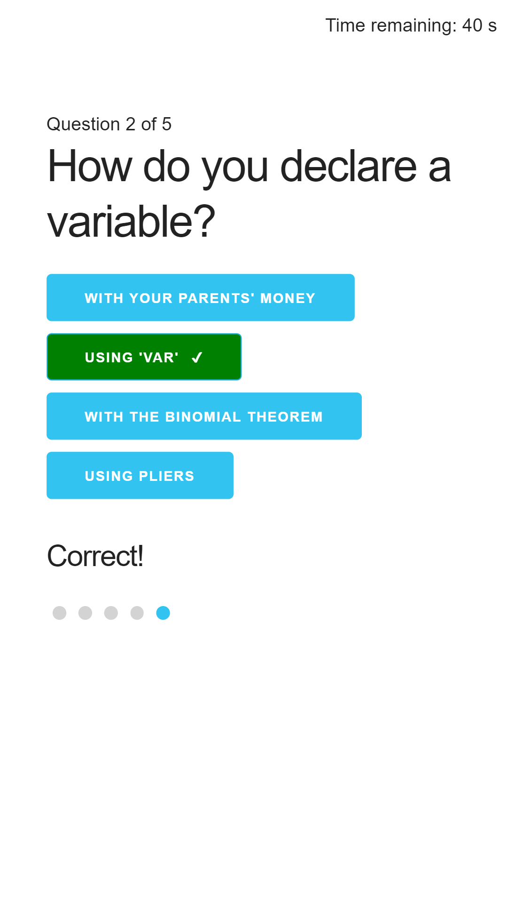

# Assignment 4: Code Quiz

## Assignment to create a responsive coding quiz with a timer, scorekeeping, and local hiscores table

The user starts at the home page and may start the quiz

Getting a correct answer starts a short timer before the next question

Getting a wrong answer starts a short timer before the next question, decrements time by 10 seconds, and tells you the correct answer

Finishing the quiz allows you to enter your score into the hiscores

Viewing the hiscores shows a locally stored copy of all hiscores, sorted by score

If there are no hiscores, or if you clear the hiscores, you are informed. \

